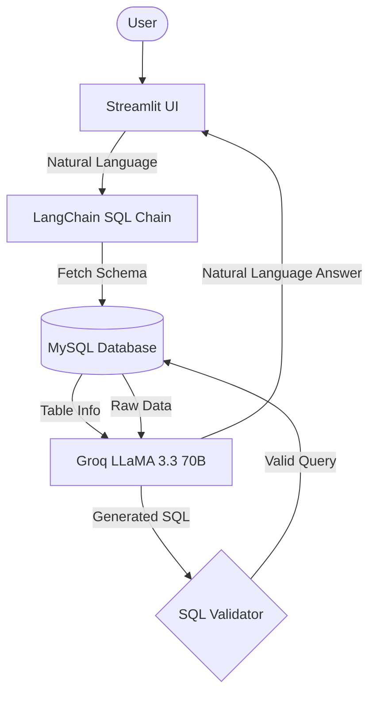

## 🤖 LexiSQL
LexiSQL transforms human questions into optimized SQL queries. It leverages Llama 3.3 (70B) to bridge the gap between complex database schemas and actionable natural language insights.
The project uses
- Engine: LangChain (Chain-of-Thought SQL generation)
- Inference: Groq Cloud (Llama 3.3 70B Versatile)
- Interface: Streamlit
- Database: MySQL / MariaDB
- ORM/Utility: SQLAlchemy & MySQL-Connector
___
### 🏗️ Project Structure
```text
LexiSQL/
├── myenv/             # Virtual environment
├── app.py             # Main Streamlit application
├── .env               # Environment variables (API Keys)
└── requirements.txt   # Project dependencies
```
___
### 🧠 Architecture Overview

___
### ⚙️ Prerequisites
Make sure you have the following installed:
- Python 3.10+
- MySQL Server: A local or remote instance (v8.0+ recommended).
- Groq API Key: Required for high-speed Llama 3.3 inference.
- Database User: Credentials with SELECT permissions (and INFORMATION_SCHEMA access).
- Virtual Environment: venv or conda for dependency management.
___
### 🔐 Environment Variables
Create a .env file in the project root:
- GROQ_API_KEY = your_groq_api_key
___
### 📦 Installation
1. Clone the Repository
- git clone https://github.com/your-username/lexisql.git
- cd lexisql
- 
2. Install Python Dependencies
- pip install -r requirements.txt
- Configure Environment

3. Create a .env file in the root directory.
- Add your API key: GROQ_API_KEY=your_groq_api_key_here

4. Run the Streamlit App
- streamlit run app.py
- The app will be available at: http://localhost:8501
___
### 🚀 How to Use
Step 1: Connect to MySQL
- Enter your host, port, and user credentials in the sidebar.
- Provide the database name you wish to query.
- Click Connect to initialize the schema introspection.

Step 2: Ask Questions
- Type questions in natural language (e.g., "Who are the top 10 customers by spend?").
- LexiSQL will generate the SQL, execute it, and explain the results.

Step 3: Refine and Follow-up
- The assistant maintains chat history. You can ask follow-up questions like "Now filter that list for users in London."

Security Handling:
- 🛡️ Keyword Validation: Prevents execution of malformed or non-SQL strings.
- ⚠️ Error Catching: Provides user-friendly messages for connection timeouts or invalid database names.
___
### 🧩 Future Improvements
- Schema Caching: Implement local caching of table metadata to reduce startup connection time.
- Query Visualization: Automatically generate Plotly or Altair charts for numerical result sets.
- SQL Preview Toggle: Allow power users to view and edit the generated SQL before execution.
- Read-Only Enforcement: Built-in logic to strictly block DROP, DELETE, or TRUNCATE commands at the application level.
- Multi-DB Support: Support for PostgreSQL and SQLite dialects.
- Export Results: Download query results as CSV or JSON directly from the UI.
___
### 📜 License
This project is licensed under the MIT License.
